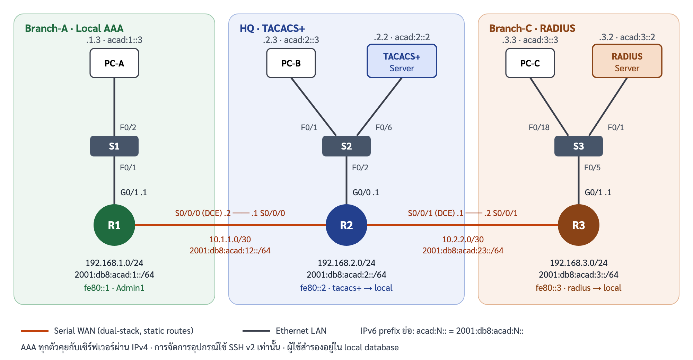

# รันบุ๊กและสคริปต์การสาธิต: AAA Authentication บน Cisco Router (กลุ่ม 9)

CP353301 Internetworking · Capstone Project Part II: Simulation Demo

แลบฐาน: Packet Tracer 26.2.5 *Configure AAA Authentication on Cisco Routers* ต่อยอดด้วย IPv6 dual-stack, SSH บน R2/R3 และการฉีดข้อผิดพลาด 3 สถานการณ์

| รหัสนักศึกษา | ชื่อ | บทบาทในวันนำเสนอ |
|---|---|---|
| 663380616-4 | นายเกรียงไกร ประเสริฐ | ผู้พูด 1: เปิด, สถานการณ์ธุรกิจ, โทโพโลยี, สรุป/คุมเวลา Q&A |
| 663380045-1 | นายปิติ มูลเทพพิชัย | ผู้พูด 2: แนวคิด AAA, มาตรฐาน, TS1 |
| 663380610-6 | นางสาวภัทราวดี ส่องศรีโรจน์ | ผู้พูด 3: การกำหนดค่า, กรณีทดสอบ, เดโมการทำงานปกติ |
| 673380577-9 | นายจีรภัทร แก้วดี | ผู้พูด 4: TS2, การวิเคราะห์เปรียบเทียบ |

คำสั่งทุกบรรทัดในเอกสารนี้คัดลอกไปวางได้ทันที ผลลัพธ์ที่แสดงเป็นตัวอย่าง ข้อความจริงใน Packet Tracer อาจต่างเล็กน้อย

---

## 0. ภาพรวม



### แผนแอดเดรส (IPv4 จากแลบ + IPv6 ที่เพิ่ม)
| อุปกรณ์ | อินเทอร์เฟซ | IPv4 | IPv6 global | Link-local | Gateway |
|---|---|---|---|---|---|
| R1 | G0/1 | 192.168.1.1/24 | 2001:db8:acad:1::1/64 | fe80::1 | – |
| R1 | S0/0/0 (DCE) | 10.1.1.2/30 | 2001:db8:acad:12::2/64 | fe80::1 | – |
| R2 | G0/0 | 192.168.2.1/24 | 2001:db8:acad:2::1/64 | fe80::2 | – |
| R2 | S0/0/0 | 10.1.1.1/30 | 2001:db8:acad:12::1/64 | fe80::2 | – |
| R2 | S0/0/1 (DCE) | 10.2.2.1/30 | 2001:db8:acad:23::1/64 | fe80::2 | – |
| R3 | G0/1 | 192.168.3.1/24 | 2001:db8:acad:3::1/64 | fe80::3 | – |
| R3 | S0/0/1 | 10.2.2.2/30 | 2001:db8:acad:23::2/64 | fe80::3 | – |
| TACACS+ Server | NIC (S2 F0/6) | 192.168.2.2/24 | 2001:db8:acad:2::2/64 | auto | 192.168.2.1 / fe80::2 |
| RADIUS Server | NIC (S3 F0/1) | 192.168.3.2/24 | 2001:db8:acad:3::2/64 | auto | 192.168.3.1 / fe80::3 |
| PC-A | NIC (S1 F0/2) | 192.168.1.3/24 | 2001:db8:acad:1::3/64 | auto | 192.168.1.1 / fe80::1 |
| PC-B | NIC (S2 F0/1) | 192.168.2.3/24 | 2001:db8:acad:2::3/64 | auto | 192.168.2.1 / fe80::2 |
| PC-C | NIC (S3 F0/18) | 192.168.3.3/24 | 2001:db8:acad:3::3/64 | auto | 192.168.3.1 / fe80::3 |

### บัญชีและรหัสผ่าน (ใช้ในแลบเท่านั้น)
| ใช้กับ | ชื่อผู้ใช้ | รหัสผ่าน | อยู่ที่ไหน |
|---|---|---|---|
| Console เดิม / enable | – | `ciscoconpa55` / `ciscoenpa55` | ตั้งไว้ในแลบ |
| R1 | `Admin1` | `admin1pa55` | local บน R1 |
| R2 | `Admin2` | `admin2pa55` | TACACS+ Server **และ** local บน R2 |
| R2 | `netops2` | `netops2pa55` | TACACS+ Server **เท่านั้น** |
| R3 | `Admin3` | `admin3pa55` | RADIUS Server **และ** local บน R3 |
| R3 | `netops3` | `netops3pa55` | RADIUS Server **เท่านั้น** |
| shared secret | – | `tacacspa55` / `radiuspa55` | router ↔ server |

### ไฟล์
| ไฟล์ | ใช้ทำอะไร |
|---|---|
| `configs/R1.txt`, `R2.txt`, `R3.txt` | สคริปต์วางทั้งไฟล์: คำสั่งของแลบ + SSH บน R2/R3 + IPv6 |
| `configs/hosts-ipv6.md` | ค่าที่ต้องกรอกผ่าน GUI ของ PC/Server และผู้ใช้ `netops2`/`netops3` |
| `configs/faults/TS1-…`, `TS2-…`, `TS3-…` | คำสั่งฉีดข้อผิดพลาด → วินิจฉัย → แก้ไข → ตรวจ |
| `configs/running/` | เก็บผล `show running-config` ของทุก router หลังทำเสร็จ (ส่งพร้อมงาน) |

---

## 1. เตรียมแลบ (ทำล่วงหน้าอย่างน้อย 1 วัน)

### 1.1 สร้างไฟล์แลบ
1. เปิด `26.2.5 Packet Tracer - Configure AAA Authentication on Cisco Routers.pka`
2. ทดสอบ ping ตามขั้นที่ 1 ของแลบ (PC-A→PC-B, PC-A→PC-C, PC-B→PC-C) ต้องสำเร็จก่อนเริ่ม
3. คลิก R1 → **CLI** → กด Enter → ใส่ `ciscoconpa55` → วางเนื้อหา `configs/R1.txt` ทั้งไฟล์ ทำแบบเดียวกันกับ R2 และ R3
   > ถ้า router มี RSA key อยู่แล้ว IOS จะถาม `Do you really want to replace them? [yes/no]:` ก่อน ให้ตอบ `yes` แล้วพิมพ์ `1024` เอง
4. คลิก **Check Results** ต้องได้ **100%** แล้วจับภาพหน้าจอเก็บไว้
   ถ้า R3 ไม่ได้คะแนนส่วน RADIUS ให้เพิ่มบรรทัด `radius-server host 192.168.3.2 key radiuspa55` บน R3 (แลบเตือนไว้ว่าคำสั่ง `radius server` ให้คะแนนไม่ถูกต้อง)
5. ตั้งค่า GUI ตาม `configs/hosts-ipv6.md` (IPv6 ของ PC/Server และผู้ใช้ `netops2`, `netops3`)
6. **File → Save As** `grp9-AAA-Capstone.pkt` (ถ้า Packet Tracer ไม่ให้บันทึกไฟล์ activity เป็น .pkt ให้บันทึกเป็น `grp9-AAA-Capstone.pka`) แล้วทำสำเนาสำรองไว้อีกไฟล์
7. เก็บ running-config: บนแต่ละ router รัน `show running-config` แล้วคัดลอกผลไปไว้ที่ `configs/running/R1-running.txt` (R2, R3 เช่นเดียวกัน)

### 1.2 Checklist ซ้อมใหญ่ (ทำครบทุกข้อและจดผลจริงลงในช่องว่าง)
- [ ] กรณีทดสอบ T01–T12 ในหัวข้อ 4 ผ่านทุกข้อ
- [ ] TS1: login ด้วย `Admin2` ระหว่างที่ key ผิด ได้ผลแบบ **a** (เข้าได้ผ่าน local) หรือ **b** (เข้าไม่ได้) → ผลจริง: ____
- [ ] คำสั่งที่ Packet Tracer รับได้: `debug aaa authentication` ☐ `debug tacacs` ☐ `debug radius` ☐ `show running-config | section` ☐
      ตัวที่ไม่รับ ให้ข้ามในวันจริงและใช้คำสั่งทดแทนที่ระบุไว้ใน TS
- [ ] TS2: ระยะเวลาที่ `Admin3` รอก่อนเข้าได้ (timeout ของ RADIUS) ประมาณ ____ วินาที
- [ ] T12 (SSH ผ่าน IPv6) ทำได้หรือไม่ ____ ถ้าไม่ได้ ให้ตัดออกจากเดโมและใช้ ping IPv6 แทน
- [ ] จับภาพหน้าจอผลของทุกขั้นในหัวข้อ 3 เก็บไว้ใน `screenshots/` เป็นแผนสำรอง
- [ ] ซ้อมจับเวลาครบ 15 นาทีอย่างน้อย 1 รอบ

### 1.3 ก่อนขึ้นพูด 10 นาที
1. เปิด `grp9-AAA-Capstone.pkt` (ไฟล์ที่ยังไม่ได้ฉีดข้อผิดพลาด)
2. เปิดหน้าต่างไว้ล่วงหน้า: R1 CLI, R2 CLI, R3 CLI, S3 CLI, PC-A/PC-B/PC-C → Command Prompt
3. **Login ค้างไว้ที่ console ของ R2 และ R3 ใน privileged mode** (`Admin2`/`Admin3` แล้ว `enable`) ห้ามพิมพ์ `exit` ระหว่างเดโม เพื่อไม่ให้ล็อกตัวเองออกตอนฉีดข้อผิดพลาด
4. อยู่ในโหมด **Realtime** และเปิดสไลด์ไว้หน้า 1

---

## 2. การกำหนดค่า (สรุปจาก `configs/`)

| อุปกรณ์ | Method list | ใช้กับ | ลำดับการตรวจสอบสิทธิ์ |
|---|---|---|---|
| R1 | `default` | console | local |
| R1 | `SSH-LOGIN` | vty 0 4 (SSH เท่านั้น) | local |
| R2 | `default` | console + vty (SSH) | TACACS+ 192.168.2.2 → local |
| R3 | `default` | console + vty (SSH) | RADIUS RAD-SERVER 192.168.3.2 → local |

หลักการสำคัญที่ต้องอธิบายได้: IOS จะลองวิธีถัดไปใน method list (`local`) **เฉพาะเมื่อวิธีก่อนหน้าตอบ ERROR** (เช่นติดต่อเซิร์ฟเวอร์ไม่ได้ / หมดเวลา) **ไม่ใช่เมื่อเซิร์ฟเวอร์ตอบ FAIL** (รหัสผิด) ดังนั้นการพิมพ์รหัสผิดกับเซิร์ฟเวอร์จะไม่ไปลอง local ต่อ

---

## 3. สคริปต์การสาธิต 15 นาที

| เวลา | สไลด์ | ผู้พูด | ทำอะไร |
|---|---|---|---|
| 0:00–1:00 | 1–2 | ผู้พูด 1 | แนะนำกลุ่ม หัวข้อ และวาระ |
| 1:00–3:00 | 3–5 | ผู้พูด 1 | สถานการณ์ธุรกิจ, โทโพโลยี, แผนแอดเดรส v4/v6 |
| 3:00–5:00 | 6–8 | ผู้พูด 2 | AAA และ method list, มาตรฐาน RFC, การปรับปรุงสมัยใหม่ |
| 5:00–6:00 | 9–11 | ผู้พูด 3 | อธิบาย config R1/R2/R3 และตารางกรณีทดสอบ |
| 6:00–8:00 | 12–15 | ผู้พูด 3 | **เดโมสด A:** การทำงานปกติ |
| 8:00–10:00 | 16–18 | ผู้พูด 2 | **เดโมสด B:** TS1 TACACS+ key ไม่ตรง |
| 10:00–12:00 | 19–21 | ผู้พูด 4 | **เดโมสด C:** TS2 ลิงก์ RADIUS ล่ม |
| 12:00–14:00 | 22 | ผู้พูด 4 | เปรียบเทียบ Local / TACACS+ / RADIUS และเมทริกซ์ |
| 14:00–15:00 | 23 | ผู้พูด 1 | สรุปและรับคำถาม |

### เดโม A – การทำงานปกติ (2 นาที)
**A1. Local AAA + SSH บน R1** — PC-A → Command Prompt
```
ssh -l Admin1 192.168.1.1
```
ใส่ `admin1pa55` → ได้ `R1>` → พิมพ์ `exit`
พูด: "R1 ไม่มีเซิร์ฟเวอร์ จึงใช้ฐานข้อมูล local ผ่าน method list ชื่อ SSH-LOGIN และ vty รับเฉพาะ SSH"

**A2. TACACS+ บน R2** — R2 console (login ค้างไว้แล้ว)
```
show running-config | include aaa|tacacs
```
แล้วที่ PC-B:
```
ssh -l netops2 192.168.2.1
```
ใส่ `netops2pa55` → ได้ `R2>` → `exit`
พูด: "netops2 ไม่มีใน local ของ R2 ถ้าเข้าได้แปลว่า TACACS+ Server เป็นผู้ตรวจสอบสิทธิ์จริง"

**A3. RADIUS บน R3** — PC-C
```
ssh -l netops3 192.168.3.1
```
ใส่ `netops3pa55` → ได้ `R3>` → `exit`

**A4. Data plane IPv4/IPv6** — PC-A
```
ping 192.168.3.3
ping 2001:db8:acad:3::3
```
(ถ้ามีเวลา) R2: `show ipv6 route` ชี้ static route 2 เส้นไป acad:1 และ acad:3

> ทางเลือกถ้าเวลาเหลือ: สลับเป็นโหมด **Simulation** → Edit Filters เลือกเฉพาะ TACACS → ssh จาก PC-B อีกครั้ง → กด Play จะเห็น PDU TACACS วิ่ง R2 ↔ TACACS+ Server

### เดโม B – TS1: TACACS+ shared key ไม่ตรง (2 นาที)
ไฟล์: `configs/faults/TS1-R2-tacacs-key-mismatch.txt`

1. **ฉีด** (R2 console): พูดว่า "จำลองผู้ดูแลพิมพ์ key ผิดตอนเปลี่ยน key"
   ```
   configure terminal
   tacacs-server key tacacspa5
   end
   ```
2. **อาการ** (PC-B): `ssh -l netops2 192.168.2.1` → login ไม่ได้
   แล้วลอง `ssh -l Admin2 192.168.2.1` → อธิบายตามผลที่จดไว้ตอนซ้อม (a: เข้าได้เพราะ fallback ไป local / b: เข้าไม่ได้)
3. **วินิจฉัย** (R2 console) ไล่จากชั้นล่างขึ้นบน
   ```
   ping 192.168.2.2
   show running-config | include tacacs
   debug aaa authentication
   ```
   ให้คนที่ PC-B ลอง ssh อีกครั้งแล้วอ่าน debug จากนั้น `undebug all`
   เปิด TACACS+ Server → Services → AAA ชี้ช่อง Secret = `tacacspa55` เทียบกับ router = `tacacspa5`
   พูด: "ping ผ่าน แสดงว่าเส้นทางปกติ ปัญหาอยู่ชั้นแอปพลิเคชัน คือ shared secret ไม่ตรง ข้อมูล TACACS+ ถูกเข้ารหัสด้วย key นี้ทั้งก้อน ฝั่งเซิร์ฟเวอร์จึงอ่านคำขอไม่ออก"
4. **แก้ไข**
   ```
   configure terminal
   tacacs-server key tacacspa55
   end
   ```
5. **ตรวจ** (PC-B): `ssh -l netops2 192.168.2.1` → `R2>` สำเร็จ

### เดโม C – TS2: ลิงก์ไป RADIUS Server ล่ม (2 นาที)
ไฟล์: `configs/faults/TS2-S3-radius-link-down.txt`

1. **ฉีด** (S3 console): พูดว่า "จำลองพอร์ตเซิร์ฟเวอร์ถูกปิดระหว่างงานบำรุงรักษา"
   ```
   configure terminal
   interface f0/1
    shutdown
    end
   ```
2. **อาการ** (PC-C):
   `ssh -l netops3 192.168.3.1` → ไม่ได้ (ผู้ใช้มีเฉพาะบนเซิร์ฟเวอร์)
   `ssh -l Admin3 192.168.3.1` → เข้าได้หลังหน่วงไปครู่หนึ่ง
   พูด: "ช่วงที่หน่วงคือ router รอ RADIUS จนหมดเวลา (ERROR) แล้วจึงใช้ local ตาม method list นี่คือการออกแบบเพื่อความพร้อมใช้งาน"
3. **วินิจฉัย** (R3 console)
   ```
   ping 192.168.3.2
   show ip interface brief
   show arp
   ```
   ping ไม่ผ่าน แต่ G0/1 ของ R3 ยัง up/up และไม่มี ARP ของ .2 → ปัญหาอยู่ที่ Layer 2 ฝั่งเซิร์ฟเวอร์ → ไปที่ S3
   ```
   show interfaces status
   ```
   เห็น Fa0/1 เป็น disabled
4. **แก้ไข** (S3)
   ```
   configure terminal
   interface f0/1
    no shutdown
    end
   ```
5. **ตรวจ**: R3 `ping 192.168.3.2` สำเร็จ (ครั้งแรกอาจหาย 1 แพ็กเก็ตระหว่าง ARP) → PC-C `ssh -l netops3 192.168.3.1` เข้าได้ทันทีโดยไม่หน่วง

---

## 4. กรณีทดสอบ

| ID | ระนาบ | ทดสอบ | คำสั่ง / ที่ไหน | ผลที่คาด | ผล |
|---|---|---|---|---|---|
| T01 | Data | IPv4 end-to-end | PC-A `ping 192.168.2.3`, `ping 192.168.3.3`; PC-B `ping 192.168.3.3` | สำเร็จทุกครั้ง | ☐ |
| T02 | Data | IPv6 end-to-end | PC-A `ping 2001:db8:acad:2::3`, `ping 2001:db8:acad:3::3`; PC-B `ping 2001:db8:acad:3::3` | สำเร็จทุกครั้ง | ☐ |
| T03 | Control | ตาราง route IPv6 | R1/R3 `show ipv6 route`; R2 `show ipv6 route` | R1/R3 มี `S ::/0`, R2 มี S 2 เส้น | ☐ |
| T04 | Mgmt | AAA ของ R1 | R1 `show running-config \| include aaa` | `aaa new-model`, `default local`, `SSH-LOGIN local` | ☐ |
| T05 | Mgmt | Console R1 ด้วย local | R1 `exit` แล้ว login `Admin1` | ได้ `R1>` | ☐ |
| T06 | Mgmt | SSH R1 | PC-A `ssh -l Admin1 192.168.1.1` | ได้ `R1>`; R1 `show ip ssh` = version 2.0 | ☐ |
| T07 | Security | ปิด Telnet | PC-A `telnet 192.168.1.1` | ถูกปฏิเสธ | ☐ |
| T08 | Mgmt | TACACS+ ตอบจริง | R2 console login `Admin2`; PC-B `ssh -l netops2 192.168.2.1` | ได้ `R2>` ทั้งคู่ | ☐ |
| T09 | Mgmt | RADIUS ตอบจริง | R3 console login `Admin3`; PC-C `ssh -l netops3 192.168.3.1` | ได้ `R3>` ทั้งคู่ | ☐ |
| T10 | Security | FAIL ไม่ fallback | PC-B `ssh -l netops2 192.168.2.1` ใส่รหัสผิด | ถูกปฏิเสธ, ไม่ไปลอง local | ☐ |
| T11 | Packet | เห็นแพ็กเก็ต AAA | Simulation mode filter TACACS / RADIUS แล้วทำ T08/T09 ซ้ำ | เห็น PDU ระหว่าง router ↔ server | ☐ |
| T12 | Data | SSH ผ่าน IPv6 (ทางเลือก) | PC-A `ssh -l Admin1 2001:db8:acad:1::1` | ได้ `R1>` ถ้า PT รองรับ | ☐ |

---

## 5. สถานการณ์ข้อผิดพลาด (ฉบับเต็ม)

ทุกสถานการณ์ใช้ขั้นตอนเดียวกัน: **ฉีด → สังเกตอาการ → ตั้งสมมติฐาน → ไล่ตรวจจาก Layer 1 ขึ้นไป → แก้ → ตรวจซ้ำ** คำสั่งครบทุกบรรทัดอยู่ใน `configs/faults/`

### TS1 – TACACS+ shared key ไม่ตรง (R2)
| ขั้น | รายละเอียด |
|---|---|
| สาเหตุจำลอง | พิมพ์ key ผิดตอนเปลี่ยน key: `tacacs-server key tacacspa5` |
| อาการ | `netops2` login ไม่ได้; `Admin2` เข้าได้หรือไม่ขึ้นกับว่า IOS มองการตอบกลับเป็น ERROR (ไป local) หรือ FAIL |
| สมมติฐาน | (1) เซิร์ฟเวอร์ติดต่อไม่ได้ (2) ค่า host/key ผิด (3) ผู้ใช้ไม่มีในเซิร์ฟเวอร์ |
| ตรวจ | `ping 192.168.2.2` ผ่าน → ตัด (1); `show running-config \| include tacacs` เห็น key `tacacspa5`; `debug aaa authentication`; เทียบ Secret ใน Server → AAA |
| แก้ | `tacacs-server key tacacspa55` |
| ยืนยัน | `netops2` และ `Admin2` login ผ่าน SSH ได้ |
| บทเรียน | เปลี่ยน key ทีละฝั่งในช่วงบำรุงรักษา ทดสอบด้วย user ที่มีเฉพาะบนเซิร์ฟเวอร์ และไม่ logout จาก session เดิมจนทดสอบผ่าน |

### TS2 – ลิงก์ไป RADIUS Server ล่ม (S3 Fa0/1)
| ขั้น | รายละเอียด |
|---|---|
| สาเหตุจำลอง | `shutdown` ที่ S3 Fa0/1 (พอร์ตของ RADIUS Server) |
| อาการ | `netops3` ไม่ได้; `Admin3` เข้าได้หลังรอ timeout |
| ตรวจ | R3 `ping 192.168.3.2` ไม่ผ่าน → `show ip interface brief` G0/1 up/up → `show arp` ไม่มี .2 → S3 `show interfaces status` Fa0/1 disabled |
| แก้ | S3 `interface f0/1` → `no shutdown` |
| ยืนยัน | ping ผ่าน, `netops3` เข้าได้ทันที |
| บทเรียน | fallback `local` ทำให้ผู้ดูแลยังเข้าอุปกรณ์ได้ตอนเซิร์ฟเวอร์ล่ม ระบบจริงควรมีเซิร์ฟเวอร์ 2 ตัวใน server group และมีระบบเฝ้าระวังพอร์ตเซิร์ฟเวอร์ |

### TS3 (สำรอง) – SSH ถูกปฏิเสธบน R1
| ขั้น | รายละเอียด |
|---|---|
| สาเหตุจำลอง | `line vty 0 4` → `transport input telnet` |
| อาการ | PC-A `ssh` ได้ "Connection refused" แต่ ping ผ่าน |
| ตรวจ | `show ip ssh` ปกติ → `show running-config \| begin line vty` เห็น `transport input telnet` |
| แก้ | `transport input ssh` |
| ยืนยัน | SSH เข้าได้, Telnet ถูกปฏิเสธ |

---

## 6. คืนค่าหลังเดโม / ก่อนรอบถัดไป
- TS1: `tacacs-server key tacacspa55`
- TS2: S3 `interface f0/1` → `no shutdown`
- TS3: `line vty 0 4` → `transport input ssh`
- ทุกตัว: `undebug all`
- วิธีเร็วที่สุด: ปิด Packet Tracer **โดยไม่บันทึก** แล้วเปิด `grp9-AAA-Capstone.pkt` ใหม่

## 7. แผนสำรอง
| ปัญหา | ทำอย่างไร |
|---|---|
| Packet Tracer ค้างหรือปิดเอง | เปิดไฟล์สำเนาสำรอง; ระหว่างรอ ผู้พูดคนถัดไปอธิบายสไลด์ต่อ |
| ล็อกตัวเองออกจาก console | ใช้ session ที่ค้างไว้; ถ้าไม่มี ให้ใช้ `Admin2`/`Admin3` (local fallback) หรือเปิดไฟล์ใหม่ |
| คำสั่ง debug ไม่ทำงาน | ข้ามไปใช้ `show running-config`, `ping` และโหมด Simulation |
| เวลาไม่พอ | ตัด A4 และข้อเสริม Simulation; TS3 ไม่ต้องทำ |
| ผลไม่ตรงที่ซ้อม / PT ใช้ไม่ได้ | อธิบายจากสไลด์เดโมทีละขั้น (หน้า 13–15, 17–18, 20–21) หรือภาพหน้าจอใน `screenshots/` |

---

## 8. เตรียมตอบคำถาม

**TACACS+ ต่างจาก RADIUS อย่างไร**
TACACS+ ใช้ TCP พอร์ต 49 เข้ารหัสเนื้อหาทั้งแพ็กเก็ต และแยก authentication / authorization / accounting ออกจากกัน จึงอนุญาตคำสั่งรายคำสั่งได้ เหมาะกับการจัดการอุปกรณ์ RADIUS ใช้ UDP 1812/1813 (Cisco รุ่นเก่า 1645/1646) ซ่อนเฉพาะรหัสผ่าน และรวม authentication กับ authorization ในคำตอบเดียว เหมาะกับการยืนยันตัวตนผู้ใช้เครือข่าย เช่น 802.1X, VPN, Wi-Fi

**ทำไมใส่ `local` ต่อท้าย `group tacacs+`**
ถ้าเซิร์ฟเวอร์ติดต่อไม่ได้ ผู้ดูแลยังเข้าอุปกรณ์ได้ด้วยบัญชีสำรอง IOS จะไปลอง local เฉพาะกรณี ERROR (ติดต่อไม่ได้ / หมดเวลา) ถ้าเซิร์ฟเวอร์ปฏิเสธ (FAIL) จะไม่ไปลองต่อ จึงไม่เป็นช่องโหว่ให้เดารหัสผ่าน local

**ถ้าพิมพ์ `aaa new-model` ก่อนสร้าง username จะเกิดอะไร**
vty จะใช้ method list `default` ทันที ถ้ายังไม่มีผู้ใช้ใน local และไม่มีเซิร์ฟเวอร์ จะเข้าทาง vty ไม่ได้ จึงต้องสร้าง username ก่อนเปิด AAA เสมอ

**ทำไม R1 ใช้ named list `SSH-LOGIN` ไม่ใช้ `default`**
แยกนโยบายของแต่ละ line ได้ เช่น ต่อไปให้ vty ใช้เซิร์ฟเวอร์ แต่ console ยังใช้ local ได้โดยไม่กระทบกัน

**`username … secret` ต่างจาก `password` อย่างไร**
`secret` เก็บเป็น hash ทางเดียว (Packet Tracer ใช้ MD5 type 5) ส่วน `password` เก็บแบบอ่านกลับได้ IOS 15.3 ขึ้นไปควรใช้ `algorithm-type scrypt` (type 9)

**ทำไมใช้ SSH และ RSA 1024 bit**
Telnet ส่งรหัสผ่านเป็นข้อความธรรมดา SSH version 2 ต้องการ key อย่างน้อย 768 bit ในแลบใช้ 1024 ตามโจทย์ ระบบจริงควรใช้ 2048 bit ขึ้นไป

**ทำไมใช้ `tacacs-server host` ที่ถูกเลิกใช้แล้ว**
Packet Tracer ยังไม่รองรับรูปแบบใหม่ `tacacs server NAME` → `address ipv4` → `key` บนอุปกรณ์จริงควรใช้รูปแบบใหม่ ส่วน RADIUS ใช้รูปแบบใหม่ `radius server RAD-SERVER` แล้ว

**ทำไมเพิ่ม `netops2` / `netops3`**
`Admin2`/`Admin3` มีทั้งบนเซิร์ฟเวอร์และใน local ถ้าเข้าได้จะบอกไม่ได้ว่าใครตรวจสอบสิทธิ์ ผู้ใช้ที่มีเฉพาะบนเซิร์ฟเวอร์จึงพิสูจน์ได้ว่าเซิร์ฟเวอร์ตอบจริง

**ทำไม AAA ยังคุยกับเซิร์ฟเวอร์ผ่าน IPv4 ทั้งที่เป็น dual-stack**
ค่า Network Configuration บนเซิร์ฟเวอร์ใน Packet Tracer ผูกกับ IPv4 ของ router ระบบจริงใช้ `address ipv6` ใน `radius server` / `tacacs server` ได้ การทำ dual-stack ในแลบนี้พิสูจน์ data plane และการจัดการอุปกรณ์ผ่าน IPv6

**ทำให้เซิร์ฟเวอร์ AAA ไม่เป็นจุดล้มเหลวเดียวได้อย่างไร**
ใส่เซิร์ฟเวอร์อย่างน้อย 2 ตัวใน `aaa group server tacacs+ …` หรือ `aaa group server radius …` วางคนละไซต์ แล้วยังคง `local` ไว้ท้ายสุด

**Accounting อยู่ตรงไหน**
แลบนี้ทำเฉพาะ authentication ระบบจริงควรเพิ่ม `aaa accounting exec default start-stop group tacacs+` และ `aaa accounting commands 15 default start-stop group tacacs+` เพื่อเก็บประวัติว่าใครพิมพ์คำสั่งอะไร

**Blast-RADIUS คืออะไร**
CVE-2024-3596 อาศัยจุดอ่อนของ MD5 ใน RADIUS/UDP ปลอมคำตอบ Access-Reject ให้เป็น Access-Accept ได้ ป้องกันโดยบังคับใช้ Message-Authenticator ทุกแพ็กเก็ต และระยะยาวย้ายไป RADIUS over TLS (RadSec) หรือ RADIUS/1.1 (RFC 9765)
